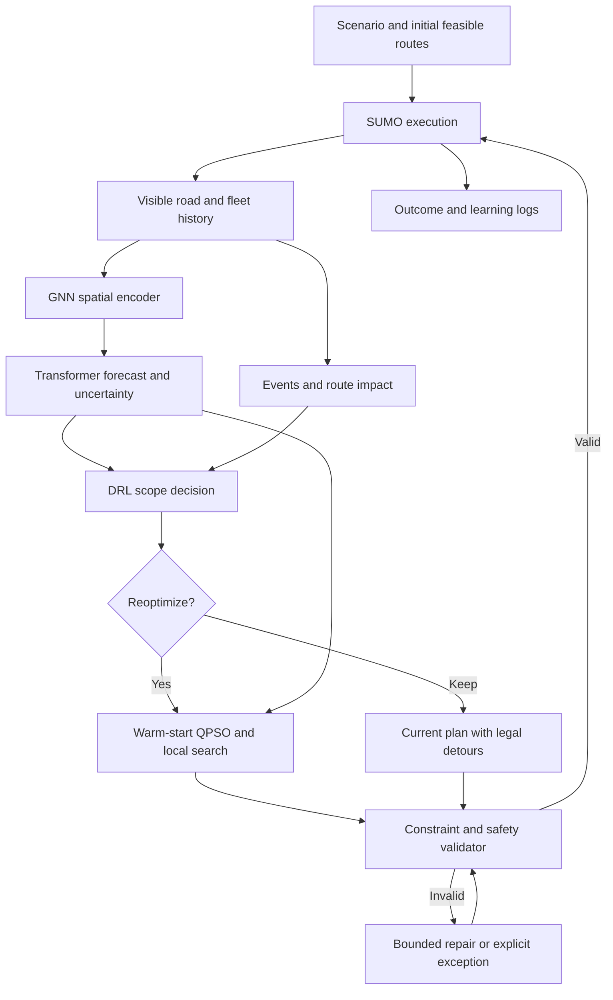
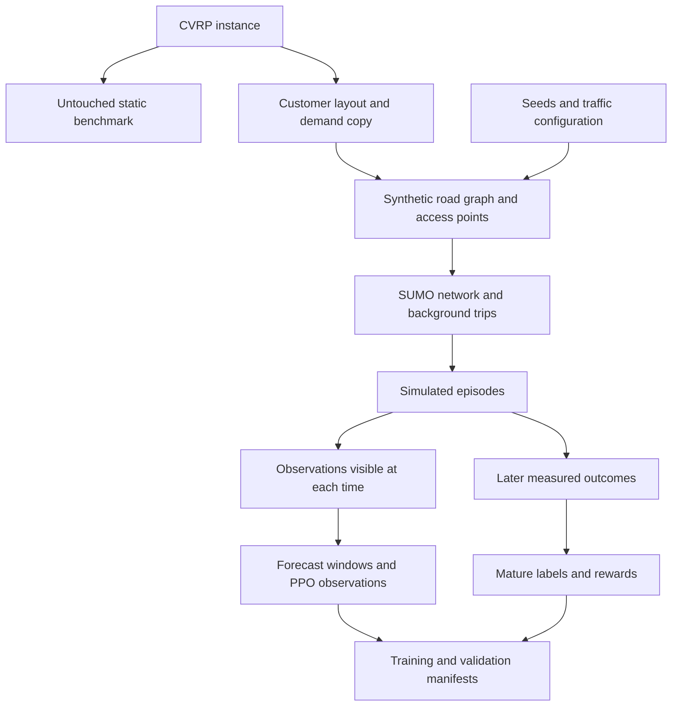
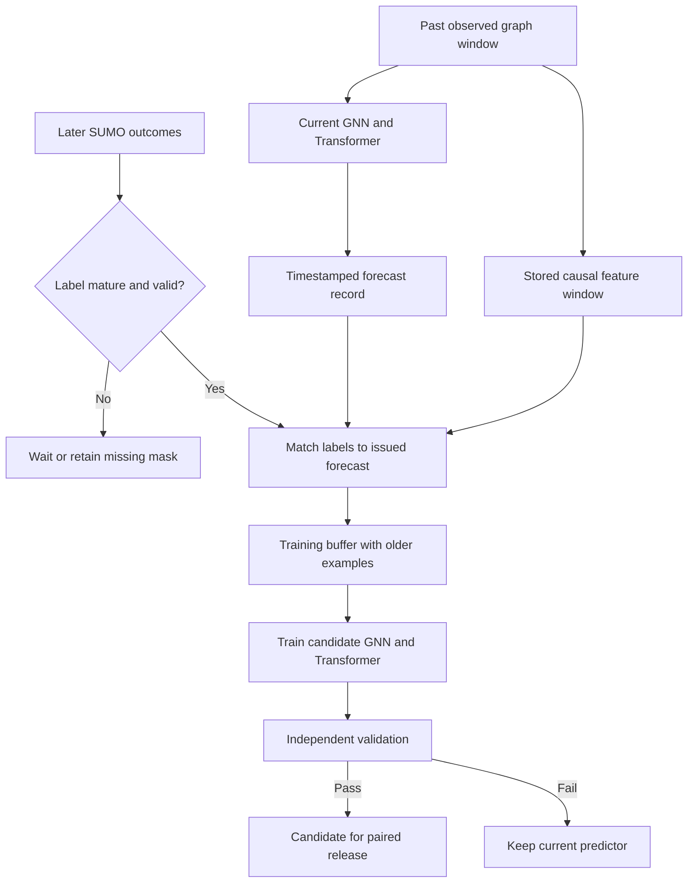
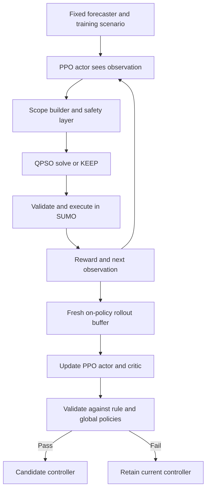
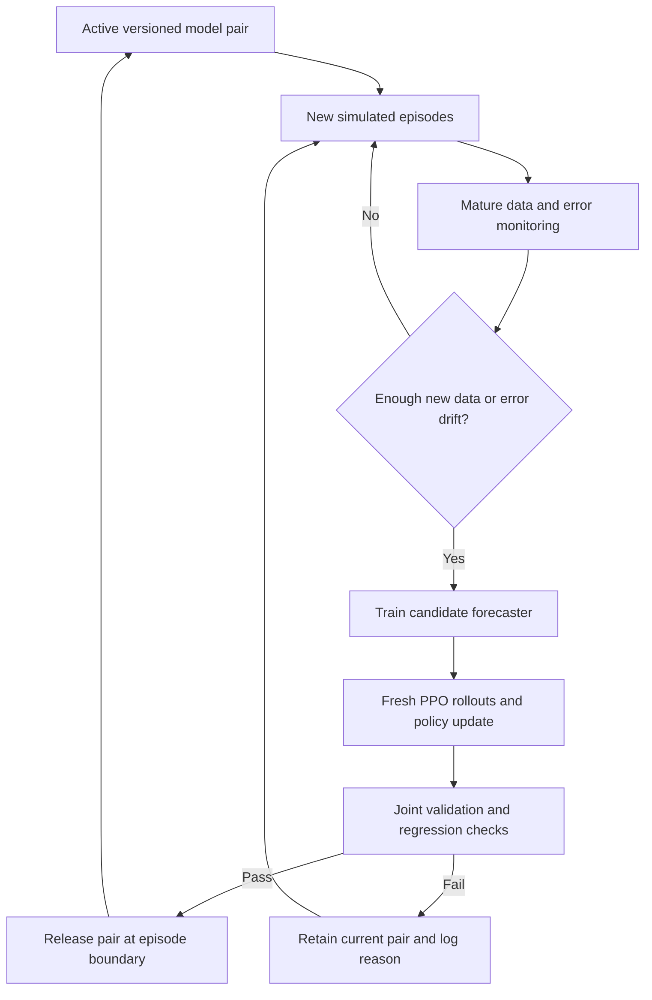
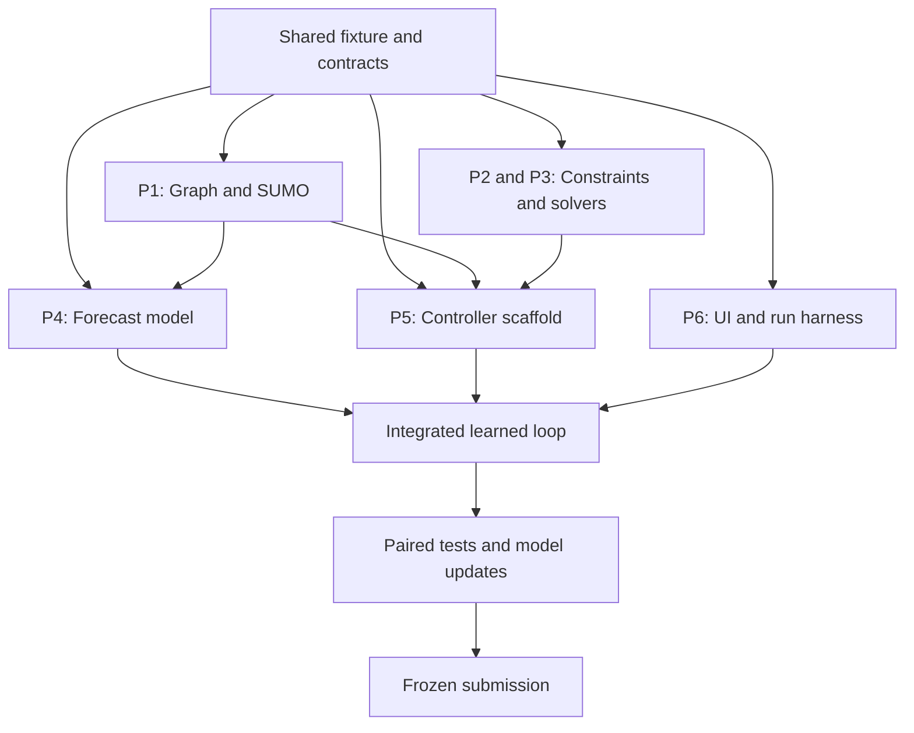

SIH26137

**Build a quantum-inspired traffic-routing platform with QPSO as its working optimization engine.** The platform must generate constrained vehicle routes on a changing road graph, support a shortest-path demonstration, expose an executable UI/API, and produce systematic benchmark, convergence and scalability evidence. The dispatcher demonstration makes those capabilities visible.

The working title is **Adaptive Quantum-Inspired Vehicle Routing under Dynamic Traffic**. The core method combines GNN spatial encoding, Transformer traffic forecasting, PPO/DRL replanning control, random-key QPSO with feasible decoding and warm starts, and SUMO execution and feedback. Classical solvers initialize or benchmark the method; they do not replace the quantum-inspired core. All quantum-inspired computation runs on conventional hardware.

This is an implementation plan, not a claim that the system has been built or that QPSO has already outperformed its baselines. The PS gives no numerical definition of large-scale, acceptable optimality gap, latency, or number of test cases. The targets below are proposed engineering targets. Assume the 15-day preparation window from your original attachment; protect every required deliverable if the schedule tightens.

**The requirements are mapped directly to evidence.** Page references below refer to the uploaded SIH26137.pdf, which is the controlling source for scope.

| PS requirement | Required implementation | Evidence for submission | Owner |
|---|---|---|---|
| Weighted directed/undirected transport graph; dynamic weights (p.2, D1) | Directed road graph, stable road IDs, distance/time/congestion weights, event updates | Graph visualization, schema and before/after edge records | P1 |
| Mathematical formulation (p.2, D2) | Explicit variables, objective, service, depot and route constraints | Equations matching the code and a worked small instance | P2 |
| Capacity, time-window and flow constraints (p.2, D2) | Feasible decoder, independent validator, time propagation, route flow conservation | Passing/failing examples and violation counts | P2/P3 |
| QPSO or equivalent core (p.2, D3) | Actual QPSO sampling updates, route/particle encoding and decoding | Source, pseudocode, parameters, trace of candidate evaluations | P3 |
| Dynamic near-optimal routing (p.1 description) | Warm-start QPSO on remaining routes under changing traffic | Dynamic replay; qualified optimality/reference gaps | P3/P5 |
| Conventional metaheuristic comparison (p.1 description) | Standard PSO and an independent ALNS implementation/configuration | Matched-budget runs using the same constraints | P2 |
| Exact-method comparison (p.1 description) | Small-instance MILP; Dijkstra for fixed nonnegative path costs | Objective, lower bound, solver status and gap | P2 |
| VRP and shortest-path problems (p.1 objective 1) | Fleet mode plus source-to-destination path mode | One visible demonstration and tests for each | P3/P2/P6 |
| Travel time, distance and congestion objectives (p.1 objective 2) | Explicit primary/secondary objectives and measured components | Trade-off plots; actual simulation outcome table | P2/P5 |
| Complexity, convergence and solution quality (p.1 objective 3; p.2 expected solution) | Operation-cost discussion, convergence logging, runtime and quality measurements | Best-so-far curves, evaluations, feasible rates and runtime scaling | P3/P2 |
| Scalability (p.1 objective 4) | Customer-scale and road-network-scale experiments | Results with hardware, budgets and failure/timeout counts | P2/P5 |
| Executable UI or API plus visualization (p.2, D4) | Upload/configure scenario, solve, perturb, inspect routes | Runnable platform and documented commands | P5/P6 |
| Realistic urban or synthetic large-scale demonstration (p.2, D5) | Validated synthetic road network with varying traffic | Scenario, replay, data provenance and measured results | P1/P5/P6 |
| Algorithm, implementation and experimental documentation (p.2, D5) | Reproducible technical report and setup guide | Source register, configs, raw results and figure-generation instructions | All; P6 packages |

The statement permits simulated traffic and synthetic large-scale instances. It does not require quantum hardware, GNNs, Transformers, DRL, live traffic APIs, OSM, or SUMO. However, your chosen final architecture requires GNN, Transformer, DRL and SUMO in addition to the PS requirements. Only quantum hardware, live APIs and OSM remain optional here. Temporary persistence forecasts, rule policies and lightweight simulation support integration and ablations; they do not replace the final learning and SUMO deliverables.

**The final platform has two operating modes and one evaluation mode.** Fleet mode plans deliveries for a fixed fleet with capacity and time-window constraints. Path mode selects a source and destination and compares QPSO path search with exact snapshot Dijkstra under identical weights. Evaluation mode replays fixed scenarios, logs convergence, and generates reproducible comparisons. All modes use the same graph and cost semantics.

A normal fleet run follows: read graph and jobs; initialize a feasible plan; observe SUMO; encode road history with the GNN; forecast future edge conditions with the Transformer; detect events; select scope with DRL; run warm-start QPSO when required; validate; commit; advance SUMO; log outcomes for forecasting and policy learning. P6's screen shows the map, algorithm name, affected vehicles, current objective components, route feasibility and actual decision latency.

**Research informs implementation without proving the intended results.** The verified [QPSO analysis by Li et al.](https://arxiv.org/pdf/2308.04840) describes mean-best sampling updates and diversity considerations; it is not evidence of VRP superiority. The [ALNS maintainers' CVRP example](https://alns.readthedocs.io/en/latest/examples/capacitated_vehicle_routing_problem.html) provides destroy-and-repair building blocks, but its unlimited-fleet assumption must be replaced. [OR-Tools time-window documentation](https://developers.google.com/optimization/routing/vrptw) is useful for a reference implementation of waiting and time constraints. [SciPy MILP documentation](https://docs.scipy.org/doc/scipy/reference/generated/scipy.optimize.milp.html) exposes an exact-solver route through HiGHS, including status, dual bounds and gaps. These tools must be pinned to the installed versions.

The [PyVRP paper](https://arxiv.org/html/2403.13795v2) motivates strong baselines; its historical HGS implementation should not be assumed identical to current releases. [Boeing's OSMnx blog](https://geoffboeing.com/2016/11/osmnx-python-street-networks/) and [street-orientation analysis](https://geoffboeing.com/2018/07/comparing-city-street-orientations/) motivate topology and bearing checks for synthetic maps. [SVRPBench](https://arxiv.org/html/2505.21887v1) informs stochastic scenarios but explicitly identifies road-constrained and online extensions as future work. The previously supplied quantum/DRL citation list has not all been independently verified and should not be copied wholesale into the submission.


**Architecture overview: two learning loops around one operating loop.** This restores the role separation in your original methodology while making training targets and release rules explicit. GNN and Transformer are trained together for forecasts; DRL is trained for decisions. SUMO generates simulated observations and outcomes. QPSO performs constrained search and is not updated by gradient descent in this design.

| Component | Input | Output | How it improves |
|---|---|---|---|
| GNN | Road graph and observed edge/node features | Per-road spatial embeddings | Supervised forecast loss backpropagates through it |
| Transformer | Recent embeddings, time encoding and masks | Future edge speed/travel-time estimates with uncertainty | Same supervised loss and later matured labels |
| DRL / PPO | Embeddings, forecasts, uncertainty, events, route/fleet summaries | KEEP / LOCAL / VEHICLE / REGIONAL / GLOBAL | Fresh rollout rewards update actor and critic |
| QPSO | Legal mutable routes, cost view, scope and budget | Improved candidate route plan | Search iterations and warm starts; no automatic neural training |
| SUMO | Network, legal vehicle paths, signals, background trips and events | Vehicle trajectories, edge observations, queues and realized outcomes | Simulation parameters can be calibrated separately; SUMO is not the learned model |

**Flow 1 — the full operating architecture.** Solid arrows show data/control flow within an episode. Model weights stay fixed during that episode. The safety check applies even when DRL chooses KEEP.



The bounded repair branch has a deadline and attempt limit. If no feasible recovery exists, it records an exception and applies the defined safe waiting/defer rule rather than looping indefinitely. Predictions influence QPSO's costs as well as DRL's choice of scope. The result is a genuine prediction-informed optimization loop, not a GNN that only decorates the dashboard.

**Flow 2 — how the hybrid dataset becomes a simulation and learning dataset.** The original benchmark is kept intact for its own static evaluation.



Split base instances/maps and episodes before creating overlapping windows. Source instance, graph IDs, simulator version, traffic seed and policy/model versions travel with each record. Future event times remain on the environment side of the visibility boundary.

**The forecasting implementation has an explicit target.** Start with a two-layer edge-aware GNN, hidden width 32–64, followed by a two-layer temporal Transformer with a compatible head count, such as four heads at width 64. These are small-model starting configurations, not tuned choices. Use a 12-minute observed history and predictions at 5, 10 and 15 minutes. With batch B, history L, road edges E and feature count F, raw edge history is [B,L,E,F]; spatial output is [B,L,E,d]; per-edge temporal processing reshapes to [B×E,L,d]. Output heads return [B,E,3] for each predicted quantity. Mask padded edges and missing observations. Never globally pool all roads before asking the forecaster to predict distinct road travel times; pooling is appropriate for the DRL summary.

Use edge-aware road-junction message passing and an edge decoder from endpoint embeddings plus edge features. This keeps the physical road graph explicit. Static features include length, road class, lanes and speed limit; observed features include speed, occupancy, halting counts, observation age and closure mask. Use time-of-day encodings and legal directed connectivity. Maintain stable edge IDs after closures. A Transformer encoder sees only the past input window: it may attend across that window, but no later observations or future labels enter its input. Raw-data windows must be re-encoded when GNN weights change; cached old embeddings cannot silently train a new encoder.

Train a future speed-ratio head on available SUMO observations. Convert predictions to travel-time proxies only with declared units/masks. For a realized traversal-time head, match vehicle edge-entry and edge-exit timestamps, assign each completed traversal to its entry-time bucket, and require enough samples before using that edge/bucket label. Sparse or empty edges are missing measured labels, not zero travel time. Closure duration and trips still in progress at logging cutoff require missing/censored handling, not fabricated finite ground truth. Use a separate accessibility/status channel; never regress infinity.

The official [SUMO edge retrieval documentation](https://sumo.dlr.de/docs/TraCI/Edge_Value_Retrieval.html) distinguishes last-step measurements from stored adapted weights. A value returned from an instantaneous speed-based travel-time estimate is not automatically a completed vehicle traversal measurement. Record `target_kind` so speed proxies and realized traversal durations are not mixed. Do not train against weights that the optimizer itself wrote into the simulator.

Use masked Huber/MAE regression and, if adopted, quantile loss for 0.1/0.5/0.9 outputs. That produces an 80% nominal interval; measure empirical coverage and interval width on held-out maps and by horizon. MC dropout from the original plan remains a comparison, not proof of calibration. Record forecast MAE/RMSE, finite-label coverage, incident-only error and path-level ETA error. Validation must show usefulness relative to persistence and a temporal-only predictor, not just attractive embedding clusters.

**SUMO integration must preserve the road and fleet contracts.** Export nodes/edges to SUMO inputs, run netconvert, and retain mappings from application road IDs to SUMO edge/lane IDs, including split segments and junction connections. Background traffic, signals, service stops and delivery vehicles belong to one scenario. Keep demand, cargo ownership and job completion in application state; movement alone does not establish a served delivery. Complete a job only after its configured stop/service event. Test a one-vehicle route, a multi-vehicle schedule and a closure before generating training batches.

Collect trajectory entry/exit timestamps, speed/occupancy/halting observations, service events and incident reveal times. Aggregate traffic at the declared one-minute cadence while preserving finer vehicle/event timestamps. Do not overwrite realized SUMO speeds with forecasts and then use them as labels. Forecasts belong to the planning cost view; SUMO controls executed traffic dynamics. Do not add toy signal/queue penalties to SUMO travel times a second time.

Keep simulation time, observation cadence, optimizer deadlines and training wall-clock time separate. Asynchronous candidates carry a state version and must be revalidated against the current legal vehicle state before application. If an experiment pauses simulation while solving, disclose that convention and still report actual solve latency. Background model training never blocks an active routing episode.

**Flow 3 — improving the GNN and Transformer with supervised feedback.** Predictions and features are saved when issued; labels are attached only after their corresponding future observations or traversals are available.



A 15-minute-ahead forecast cannot provide its label after one minute. A traversal-time label may mature even later when the vehicle exits. Track forecast issue time, target bucket, measurement availability and cutoff. Backpropagation updates both the GNN and Transformer on these matured examples. PPO rewards do not directly update the forecasting network in this architecture.

**Predictions must enter routing in a controlled way.** At candidate edge entry time, interpolate within the forecast horizons, and blend with current measured conditions according to validated reliability. Beyond the horizon use an explicitly labelled persistence or time-of-day extension. A conservative travel-time quantile can be used for deadline-sensitive planning, but its path-level reliability must be evaluated; adding edge upper quantiles does not create a guaranteed route-level confidence interval. The final time-dependent route evaluator preserves entry order/FIFO and frozen commitments. Known closures override optimistic forecasts. Candidate routes are not executed against synthetic predicted truth: SUMO determines their realized outcome.

Forecasts initially condition on current observations and the active dispatch policy; they do not automatically predict the effects of every hypothetical QPSO candidate. If route changes materially alter traffic, record that feedback, reobserve after execution and train across multiple policies. Full candidate-conditioned traffic forecasting is a possible later enhancement, not a capability implied by the baseline GNN–Transformer.

**DRL learns decision quality, not forecast accuracy.** Use PPO with a five-action discrete policy, an actor and a value critic. Its observation concatenates pooled current GNN embeddings, per-horizon forecast summaries, uncertainty, affected-route fraction, deadline slack, remaining load/work, recent route changes and event flags. Keep all features normalized using training statistics. Scope selection maps an action to executable IDs and a fixed budget. The actor does not get future event tapes, future measured outcomes or hidden seeds.

The [Stable-Baselines3 PPO documentation](https://stable-baselines3.readthedocs.io/en/master/modules/ppo.html) provides a reusable PPO implementation. Plain PPO should not be assumed to support arbitrary action masks: implement a compatible masked distribution or use a verified masking-capable implementation. Keep a separate safety layer regardless. Log requested action, executed action and override reason; an overridden proposal must not be credited as if the actor independently chose the safe action.

For simpler timing, take a decision every 60 simulated seconds and let urgent events invoke immediate safety handling. If switching to variable event-to-event decisions, account for elapsed time in discounting and costs; a long interval is not equivalent to a short one. One environment step invokes the selected QPSO scope if needed, validates, executes the next interval in SUMO, and returns an observation, reward, termination and logs.

A proposed interval reward is negative normalized realized incremental operating time, congestion exposure, lateness/unserved penalties, route churn and actual computation. Use a terminal remaining-work penalty so KEEP or delaying deliveries forever does not win. Avoid rewarding repeated decreases in a predicted remaining-route cost without accounting for actual execution. Physical constraints are enforced by the validator; a negative reward is not permission to dispatch an overloaded or wrong-way route. Reward weights are fixed on development scenarios and reported with the experiment.

**Flow 4 — improving the DRL policy with experience.** This training environment contains the real QPSO adapter and SUMO step; early mocks are only for interface tests.



PPO uses fresh on-policy rollouts for its next update. Store old trajectories for audit and analysis, but do not treat an arbitrary historical replay buffer as standard PPO training data. The supervised forecaster may replay older examples to reduce forgetting; that is a different buffer. Freeze GNN/Transformer weights while collecting each PPO rollout/update batch. If forecasting weights change, collect new rollouts and validate policy compatibility before release.

The initial PPO policy can learn with a persistence forecaster while P4 trains the neural model. Once the neural forecaster is frozen, train or fine-tune the controller on its outputs. If pretraining uses the lightweight environment for speed, perform SUMO adaptation and held-out evaluation before calling it the final policy. Measure rollout throughput before selecting a total training-step budget; solver calls often dominate. Begin on smaller maps and short episodes, then expand through a documented curriculum.

**Flow 5 — continuous improvement without destabilizing the live run.** This is periodic background retraining and controlled release, not arbitrary weight changes on every simulation tick.



Start with one retraining attempt after, for example, 20 completed training episodes or a scheduled batch; profile and tune this cadence. Mix new training examples with an older scenario-balanced sample. Keep a separate rolling validation set and a never-used final test set. Error monitoring can trigger training, but final-test outcomes must not trigger tuning. Performance can worsen with new data, so “continually improves” means repeated measured improvement attempts with rejection/rollback support, not a guarantee of monotonic accuracy.

Version a release pair `(forecast_version, policy_version)` together with feature schema, scaler, graph mapping, action semantics, reward configuration, QPSO settings and simulator version. Changing the encoder can alter the DRL input distribution even if its shape stays unchanged. A candidate forecaster therefore needs policy compatibility validation; retrain/fine-tune the policy where required. Promote only at an episode boundary, or another explicitly tested safe boundary, and retain the previous pair for rollback.

Choose promotion tolerances before testing candidates: no new hard-constraint failures; forecast error/coverage within declared limits; routing quality and unserved demand noninferior within chosen validation tolerance; latency inside the declared budget. Do not select a forecaster on MAE alone. Show at least one reproducible update attempt comparing v1/v2 on the same reserved evaluation episodes. If v2 loses, display rejection honestly. Final benchmark runs freeze models and use unseen episodes with learning disabled.

**The learning deliverables are additional to every PS deliverable.**

| Deliverable | Evidence |
|---|---|
| Trained GNN–Transformer | Checkpoint, features, targets, causal splits and horizon error plots |
| Trained DRL controller | PPO config/checkpoint, action definitions, reward, rollout throughput and held-out policy comparison |
| SUMO closed loop | Network, traffic/vehicle files, TraCI adapter, incident replay and measured trajectories |
| Forecast update pipeline | Timestamped issued forecasts, mature labels, retraining records and validation decisions |
| Policy update pipeline | Fresh rollout records, actor/critic learning curves and safety-override rates |
| Joint model management | Paired version manifest, accepted/rejected update log and rollback demonstration |

Required learning ablations retain the same QPSO backbone: persistence + rules; GNN–Transformer + rules; GNN–Transformer + PPO; and the selected full pair before/after an update attempt. Add temporal-only versus GNN–Transformer to isolate spatial value. Keep the existing QPSO/PSO, warm/cold, local-search, exact, path, congestion and scaling experiments. Training compute is reported separately from online inference/replanning latency. No saved template, rule output or simulator weight should be labelled as a trained prediction.

**A concrete example connects the loops.** At 09:00, the GNN–Transformer predicts increased corridor travel time at 09:10. DRL sees the forecast, uncertainty and threatened deadline slack, and selects REGIONAL. QPSO searches only legal mutable route suffixes; the validator accepts a plan and SUMO executes it. After 09:10, the future bucket's observations become eligible forecast labels; completed traversals become usable later. Prediction error contributes to the next supervised training batch. Realized operating time, missed obligations, churn and compute contribute to the PPO rollout reward. Both candidate models are evaluated together before a new pair is released. All numbers/times in this example are illustrative.


**The graph correction that matters most.**

**Haan, point cloud se road graph banana padega for your road-level simulator—but CVRP itself is already a graph optimization problem.** A coordinate instance normally implies customer-to-customer costs through its distance rule. It does not need an explicit list of physical roads to be solvable, and a GNN can operate on a customer graph. You need a separate road graph because your traffic, closures, intersections, and vehicles have physical locations on road segments.

Maintain these three objects:

| Object | Vertices / records | Meaning of an edge or association |
|---|---|---|
| Road graph `G_road` | Junctions, road endpoints, access points | A directed traversable road segment |
| Requests | Customer identity, demand, release/service information, access location | Maps a delivery task to the road graph; several requests may share a location |
| Routing cost graph `G_stops(t)` | Depot, pending stops, current vehicle start locations | Shortest-road-path cost between two relevant locations at a specified time |

The optimizer decides customer order and vehicle allocation. The path engine turns consecutive stops into road-edge sequences. The simulator executes those edge sequences. The forecaster estimates future edge conditions.

For a snapshot approximation:

\[
C_{ij}(t)=\min_{p:i\leadsto j}\sum_{e\in p}\tau_e(t).
\]

This matrix is generally asymmetric after one-way roads or directional traffic are introduced. A closure invalidates affected path caches. Store graph version, forecast issue time, cost type, departure-time bucket, and source/target in cache keys.

For fully time-dependent evaluation, each edge is entered at a different time. Recompute the time recursively along the path, and include service/waiting time between customer legs. A single frozen matrix is a rolling-horizon approximation, not an exact time-dependent VRP solution.

**Dataset choices and what was actually inspected.**

The uploaded files contain plans rather than the raw 101-point `.vrp` instance. Consequently, the numerical audit below uses a separately downloaded public example, **E-n101-k8**. It does not claim to describe your unspecified instance.

| Dataset | What it provides | What it does not provide for this project | Decision |
|---|---|---|---|
| CVRPLIB E / X subsets | Demands, capacities, coordinates or specified costs, reference solutions | Observed road traffic and a complete physical street map | Start with a few small instances; preserve original benchmark rules |
| XML / XML100 | Diverse 100-customer static instances with known optima | Dynamic road-network ground truth | Later static test set; never compare its optimum against changed road costs |
| METR-LA / PEMS-BAY | Traffic speed time series and sensor graph resources | Your customers, delivery demands, all drivable streets, or Indian urban calibration | Optional independent forecasting study; do not make it a dependency |
| SVRPBench | Stochastic-routing instances with multiple constraint families | A ready-made road-level online city simulator | Optional external stress test after checking compatible semantics |
| OpenStreetMap | Mapped road geometry and available road tags | Guaranteed complete speed/lane tags or live traffic | Optional real-map demo with synthetic demand/traffic clearly labelled |

The [DCRNN repository](https://github.com/liyaguang/DCRNN) provides timestamp-by-sensor HDF5 data and sensor graph resources. The paper uses 207 METR-LA and 325 PEMS-BAY sensors with five-minute aggregation. These sensor graphs are not interchangeable with a delivery road graph. My review here inspected the schema and paper, not the entire HDF5 distributions. If you use them, calculate missingness, speed quantiles, autocorrelation, and day-level splits yourselves before training.

The [SVRPBench dataset viewer](https://huggingface.co/datasets/MBZUAI/svrp-bench) currently exposes 560 rows in a test split. It includes locations, demands, vehicle counts/capacities, and appearance times. A visible example lists demand greater than the displayed single capacity entry, and a capacity-list length different from vehicle count. This requires checking capacity broadcasting, split-delivery, and feasibility semantics in the original evaluator; it is not proof that the dataset is invalid. Do not silently convert all variants to your single-depot, no-split model.

The current [CVRPLIB listing](https://galgos.inf.puc-rio.br/cvrplib/index.php/en/instances) distinguished proven optima from other upper bounds, but showed no downloadable entries under its XML section during this review. XML's collection size and solved status are independently described in the authors' XL paper. Obtain the author-distributed archive before making XML download a deadline dependency. E/X subsets are enough to get started.

**The sample audit produced the following results.** I parsed the [official E-n101-k8 file](https://galgos.inf.puc-rio.br/cvrplib/index.php/en/download/instance/65), triangulated its coordinates using SciPy, then tested naive one-way conversion with 100 independently seeded random orientations.

| Quantity | Measured value |
|---|---:|
| Points / customers | 101 / 100 |
| Vehicle capacity | 200 demand units |
| Total customer demand | 1,458 |
| Demand minimum / mean / maximum | 1 / 14.58 / 41 |
| Load-only fleet lower bound `ceil(total/Q)` | 8 |
| Aggregate utilization if eight vehicles are used | 91.125% |
| Coordinate range | x: 2–67; y: 3–77 |
| Duplicate coordinate pairs | 0 |
| Undirected Delaunay edges | 290 |
| Average / maximum undirected degree | 5.743 / 9 |
| Median / longest edge length | 8.062 / 50.040 coordinate units |
| Failed strong-connectivity trials with naive 15% one-way conversion | 1 of 100 |

These are data/geometry diagnostics, not routing-performance results. For the one-way experiment, physical pairs were sorted, `round(0.15 × 290)` pairs were sampled without replacement with NumPy seeds 0–99, and one random direction was removed per sampled pair. Strong connectivity was checked on the resulting directed graph. Reproduction used NumPy 2.3.5 and SciPy 1.17.0.

The implications are practical: the graph has some very long connections, many high-degree vertices, and random directions can break access even at 15%. Eight vehicles also leave limited aggregate slack; that does not establish temporal feasibility or prove every proposed demand surge is serviceable. The capacity bound is necessary, not sufficient.

The downloaded file's old comment says “Best value: 817,” whereas the inspected library listing reports 815 with optimality marked. This illustrates why a legacy comment should not determine your benchmark reference. Freeze a dated reference solution, validate its cost under the official convention, and record its provenance.

**How to generate the hybrid synthetic dataset.**

Use the description **“benchmark-derived customer layouts with synthetic road networks and traffic.”** “Real CVRP dataset” means an established benchmark source, not necessarily real geographic coordinates. In particular, X/XML-style layouts are generated benchmark instances. Euclidean distance is mathematically computed from coordinates; it does not automatically have kilometers as its unit.

Build the generator in two passes. The first is a small debugging environment. The second is the demonstration/training environment.

**Pass 1: retain the simple Delaunay method as a debugging fixture.** Parse the 101 records, use the depot specified by the file, triangulate unique locations, turn triangle sides into undirected candidate edges, assign deterministic synthetic attributes, and verify graph connectivity. Keep customer IDs separate even when coordinates repeat. Handle omitted/degenerate points explicitly: the [SciPy documentation](https://docs.scipy.org/doc/scipy/reference/generated/scipy.spatial.Delaunay.html) warns that Qhull can omit vertices and exposes them through `coplanar`. A collinear input needs a fallback; duplicate requests should not disappear during deduplication.

For nondegenerate planar input, straight-edge Delaunay is planar, not merely “planar-ish.” However, planarity says nothing about whether a connection crosses a river, follows a street, or has a plausible road class. It can contain long hull edges and overly many triangular intersections.

**Pass 2: generate a street skeleton and attach delivery locations to it.** This is the recommended hybrid environment:

1. Preserve the original instance, IDs, demands, capacity, distance convention, and checksum. Create a separate derived scenario ID.
2. Apply one isotropic scale to the coordinates. For example, map the largest bounding-box span to 8,000 meters: `scale = 8000 / max(x_span, y_span)`. Translate then multiply both axes by the same scale. This 8-km extent is a simulation assumption, not a geographic fact.
3. Generate approximately 150–300 synthetic junction candidates over the same footprint. Grid/jittered-grid for one family; spaced irregular points for another. Allow enough boundary coverage and control minimum point separation.
4. Create candidate roads using grid adjacency or Delaunay over the junction candidates. Preferentially remove long or redundant edges while preserving connectivity. An MST is useful as a protected backbone, but an MST alone has no alternative routes; add cycles until the network has meaningful detours.
5. Create arterial corridors as connected paths between selected boundary gateways and activity centers. Define collectors feeding these corridors and local streets filling neighborhoods. Do not assign arterial status from edge-length percentile alone: road function should remain consistent across several segments.
6. For each preserved customer coordinate, find a nearby road segment, project onto it, and split the segment at that access point. Preserve the original customer coordinates and a separate snapped/access position. Record access distance and add a short legal connector or explicit access/service delay. Reject excessive snap distance. Split or reject any at-grade crossing introduced by a connector; do not invent overpasses implicitly.
7. Copy corridor class and direction consistently to split segments. Keep a parent road ID so one road closure can affect the intended physical road and all its relevant children.
8. Orient roads, assign attributes, place signals, verify reachability, and save both requested and realized configuration values.

**One-way streets need a reachability gate.** Start with both directed arcs for each physical segment. A simple robust version protects a bidirectional spanning backbone and chooses one-way segments only elsewhere. A more flexible version removes a proposed direction, checks strong connectivity or the required depot/service reachability, and restores it if the test fails. Avoid one-way dead-end access roads unless a valid return path exists. Generate coherent one-way corridors when possible. The ratio is the fraction of physical road pairs that have one permitted direction, not a fraction of already directed arcs. If the target cannot be reached safely, record the achieved ratio rather than forcing it.

**Assign internally consistent road features.** These are suggested toy-city priors, not local legal limits or empirical calibration:

| Road class | Example speed options | Lanes per direction | How selected |
|---|---|---|---|
| Local | 20 or 30 km/h | 1 | Neighborhood access |
| Collector | 30 or 40 km/h | 1–2 | Feeds an arterial corridor |
| Arterial | 40 or 50 km/h | 2 | Connected cross-city corridor |
| Access connector | 10 km/h | 1 | Short depot/customer access |

Use meters and seconds internally. For a road of length `L_m` and speed `v_kmh`, `free_flow_s = 3.6 * L_m / v_kmh`. For example, 600 m at 30 km/h takes 72 s; at 15 km/h it takes 144 s before intersection delay. If a signal adds 20 s, total time is 164 s. This arithmetic example is synthetic.

Distinguish `vehicle_capacity_units` from `road_capacity_veh_per_hour`. Assign road capacity from lane count and a configured per-lane saturation-flow assumption, modified by signal green fraction if modeled. The required simulation described later uses road capacity as a discharge-rate limit. During early graph-only development it remains descriptive metadata; do not claim capacity-driven congestion until the queue model executes it.

Road status is an explicit mask. A closed edge is forbidden to new entries, not merely assigned an enormous but finite cost. Define what happens to vehicles already on the segment: the MVP allows them to clear it and applies the closure at the next entry. That choice must be identical across policies and clearly displayed.

**Signals belong at junctions, not arbitrary customer points.** Count distinct physical approaches rather than directed in-degree plus out-degree. Choose signal candidates at three/four-arm intersections or arterial crossings. Use cycle length, phase offset, and approach-specific green intervals if modeling signals. A synthetic 60–90 s cycle is a starting parameter range, not observed data. At a red light, wait until the next permitted interval. Do not add one full signal delay to every outgoing edge or double-count delays already produced by SUMO.

**Generate traffic with structure, not independent noise on every edge.** At one-minute observation intervals, build a correlated congestion field from:

- A per-road background level.
- Peak-hour profiles with episode-specific amplitude and timing.
- Shared corridor/zone shocks.
- Temporal persistence and optional neighbor propagation.
- Incident severity with duration and recovery.
- Observation noise and missing measurements applied separately from true state.

One lightweight formulation is:

\[
z_e(t+1)=\max\{0,\rho z_e(t)+(1-\rho)[b_e+p_{r(e)}(t)+\kappa\bar z_{N(e)}(t)]+\epsilon_e(t)+i_e(t)\},
\]

\[
v_e(t)=v^{limit}_e\,\operatorname{clip}(e^{-z_e(t)},0.1,1).
\]

Here `z` is dimensionless slowdown intensity, `r(e)` is a corridor/zone, and neighbor influence should use geographically and directionally meaningful connected roads. Start with `rho=0.8`, small noise, and a modest `kappa`; inspect stability and change them by configuration. This is the controlled exogenous replay model, not a calibrated traffic-flow law. The separate queue-based evaluation later measures traffic affected by routing decisions. Set `v=0` separately for a closure. Save derived `congestion = 1 - v/v_limit` for open edges.

A warm-up period avoids making every training episode start in empty free flow. Burn in approximately 30 simulated minutes before recording the main episode. Vary peak times, persistence, incident types, corridor choices, and noise between episodes so that the model cannot win by memorizing one repeating sine wave.

**Preserve causality and sensible travel times.** Store hidden simulator truth and visible observations separately. At time `t`, the policy may see a reported closure and its observed impact, but not an unannounced reopening time, unreleased orders, or the random seed used to determine future incidents. A forecast can estimate reopening or slowdown; it cannot read the future event schedule.

Time-varying edge costs must not allow a later departure to overtake an earlier departure on the same link merely because a time bucket changed. In the lightweight simulator, traverse the remaining distance by integrating the positive speed profile over successive time intervals. Check that sampled arrival functions are nondecreasing. For the optimizer, label snapshot matrices as approximate and validate candidate routes through the temporal evaluator. If you implement exact departure-dependent path search, use a suitable FIFO time-dependent shortest-path method; ordinary snapshot Dijkstra does not make it exact.

**Keep demand semantics physically feasible.** The core demo retains the original requests and varies traffic/closures. Add online requests only after the fleet model supports them. For delivery operations, free space in a truck does not mean the goods for a newly announced order are onboard. New orders can be assigned to a depot vehicle or to a future route after a depot reload. Existing loaded orders stay with their vehicle unless an explicit transfer operation is modeled. Use customer reveal times only in a separate derived experiment, not in the untouched static benchmark.

Time windows and service durations are required in the final constrained demonstration. First construct a feasible reference schedule, then sample each window around its service-start time with configurable slack, and verify that the reference satisfies it. Keep window-generation randomness separate from optimizer randomness, and disclose this construction. Use multiple reference constructions to reduce bias toward one heuristic. Generate loose, medium and tight windows; reserve impossible deadlines for separately labelled stress tests. For optional new demand, use zone-weighted Poisson arrivals, explicit depot pickup/reload requirements, and known release times. Store `known_at_s`, `release_s`, `earliest_s`, `latest_s`, and `service_duration_s`. Never repair an impossible scenario by silently adding vehicles.

**Save a reusable dataset, not only a graph object.** Use these contracts from Day 1:

| File/table | Required fields |
|---|---|
| `scenario.json` | schema version, scenario ID, source/checksum, units, transform, all seeds, generator version, split, config, field provenance |
| `nodes` | node ID, x/y meters, kind, zone, signal metadata |
| `edges` | edge ID, parent road ID, from/to, length, road class, speed limit, directional lanes, road capacity, provenance |
| `requests` | request ID, original customer ID/coordinate, access node, access distance, demand, known/release times, earliest/latest service start, service time, status |
| `fleet` | vehicle ID, capacity, current edge/node, distance remaining, onboard request IDs, remaining load, executed prefix |
| `edge_observations` | episode, time, edge ID, observed speed/travel time, age, missingness mask, known closure state |
| `edge_truth` | episode, time, edge ID, true simulated speed/travel time/status; inaccessible to policy |
| `events` | event ID, generation time, reveal time, effect start/end, type, affected parent roads; future fields hidden from policy |
| `decisions` | decision ID, observed state version, forecast version, scope, reason, timing, candidate feasibility, accepted route version |
| `outcomes` | policy, seed, elapsed fleet time, distance, served/unserved, constraint violations, decision latency, route changes |

JSON and compressed NumPy arrays are enough at first; use Parquet when useful. Use `null` plus a status mask in JSON for unreachable travel rather than nonstandard JSON infinity. Stable edge IDs let models represent closures without deleting/reordering the underlying feature tensors.

**Learning-data budget, generated alongside the routing implementation.** Start with six tiny episodes for debugging. For the required forecaster, a possible next target is 20 training maps, four validation maps, four unseen maps from the same families, and four unseen radial maps. Generate eight four-hour episodes per map after warm-up. This creates 256 episodes and 61,440 recorded minute snapshots. With a 12-minute input history and a 15-minute maximum target horizon, each episode gives 214 eligible forecast windows, or 54,784 total overlapping windows. These windows are correlated and are not 54,784 independent experiments.

With an illustrative 1,000 directed edges and 10 float32 features, raw snapshot features alone use about 2.46 GB; metadata, truth, labels, and models add more. Do not materialize every overlapping window as a separate full copy. Profile a six-episode pilot before committing to this volume. A small team can reduce map and episode counts if throughput is insufficient; report the actual counts.

Split by base customer instance and map before creating augmented variants; then split episodes, and create windows inside each episode only. Fit normalization on training data. If a single base instance is reused across every map, report topology transfer on shared customer layouts, not transfer to new delivery distributions. Reusing the final XML benchmark as training geometry weakens held-out claims even if its traffic seed changes.

**Validate the synthetic environment with measurable properties.** Produce a compact dataset card with reachability, average physical degree, degree histogram, street-bearing histogram, edge-length quantiles, signal count, one-way fraction, customer snap-distance quantiles, shortest-path/euclidean detour ratios, rush/off-peak travel-time ratios, traffic autocorrelation, and incident recovery duration. Proposed graph priors should be compared against an inspected reference map before being described as calibrated. Passing a connectivity check proves usability, not realism.


**The mathematical model must be executable, not just a slide equation.** Use a single-depot, fixed homogeneous fleet for the first complete implementation. Model delivery demands, service-start windows, service durations, depot return and directed legal movement. Heterogeneous fleets, online new orders and vehicle breakdowns can follow after the required features work.

Let R be the road-junction set and E the directed physical road segments. Let C be customer jobs, K the available vehicles, and s/f separate departure/return copies of the depot. Each job maps to a road access point. Let A contain the allowed stop-to-stop arcs: start-to-customer, customer-to-customer, customer-to-return, and start-to-return when useful. No arcs enter s, leave f, or connect a customer to itself.

For each stop arc, compute one common composite-cost road path and retain its complete edge sequence. Record its travel duration tau_ij, distance d_ij and congestion exposure g_ij. Never combine the shortest distance from one physical path with the shortest time from another and pretend they describe the same movement. This is a candidate-path restriction; acknowledge that joint path-and-stop optimization can produce a different global optimum.

Use two clearly separated formulations:

- A fixed-weight snapshot CVRPTW model, used for the small exact-reference track and inner QPSO evaluation.
- A dynamic execution model with departure-dependent times and observed events, used for rolling-horizon simulation. Re-evaluate final candidates through this temporal model. The snapshot optimum is not the optimum of an entire dynamic day.

Define binary x_ijk for vehicle k taking stop arc i→j, y_ik for assigning customer i to k, and z_k for activating a route. Define continuous service-start times t_ik, endpoint times t_sk/t_fk, and customer visit-order variables u_ik. Demand is q_i, capacity Q_k, service duration s_i, service-start window [a_i,b_i], depot departure t0 and return deadline H. Demand units are explicit abstract load units unless a real conversion is available.

Minimize the following normalized operational objective among fully feasible solutions:

\[
J=w_T\frac{\sum_k(t_{fk}-t_0)}{T_{ref}}
 +w_D\frac{\sum_{k,(i,j)\in A}d_{ij}x_{ijk}}{D_{ref}}
 +w_G\frac{\sum_{k,(i,j)\in A}g_{ij}x_{ijk}}{G_{ref}}
 +\lambda_\Delta\Delta(R,R_{old}).
\]

The first term is total fleet operating time, including driving, waiting and service. Also report driving time separately. Reference denominators are fixed positive scales from development scenarios, not candidate-specific normalization. Default static benchmark runs use their native objective; this composite objective belongs to the derived traffic-routing track. Start with time primary and smaller distance/congestion weights; sweep a few fixed weights to show the trade-off. Set route-change penalty to zero in static comparisons. Congestion exposure can be integral of congestion intensity over traversal time; define it identically for all methods.

Impose:

\[
\sum_k y_{ik}=1\quad(i\in C),\qquad
\sum_{j:(i,j)\in A}x_{ijk}=y_{ik}
=\sum_{j:(j,i)\in A}x_{jik}.
\]

\[
\sum_{j:(s,j)\in A}x_{sjk}=z_k,
\quad\sum_{i:(i,f)\in A}x_{ifk}=z_k,
\quad y_{ik}\le z_k,
\quad\sum_i q_i y_{ik}\le Q_k.
\]

\[
a_i y_{ik}\le t_{ik}\le b_i y_{ik},\quad
 t_{jk}\ge t_{ik}+s_i+\tau_{ij}-M_{ij}(1-x_{ijk}).
\]

The time equation applies to allowed arcs including the endpoint copies, with depot service zero, t_sk=t0 and t0≤t_fk≤H. Pick valid finite M_ij from the time bounds, service durations and allowed arc durations. Remove unreachable arcs instead of representing them by infinity in the MILP. Use solver indicators if supported; otherwise validate the big-M bounds on the tiny exact fixtures.

Eliminate subtours (disconnected customer cycles) explicitly with visit-order constraints:

\[
y_{ik}\le u_{ik}\le |C|y_{ik},\qquad
u_{jk}\ge u_{ik}+1-(|C|+1)(1-x_{ijk})
\]

for customer-to-customer arcs. Binary domains, arc exclusions and finite time bounds complete this snapshot formulation. Its flow constraints ensure each used vehicle has a continuous depot-to-depot service route. Physical road paths are validated separately. Road-flow capacity is a different concept and is handled in the simulation below.

For dynamic replanning, replace each active vehicle's start by its next reachable decision point and earliest arrival there. Freeze executed edges, served customers and service in progress. Fix onboard jobs to their current vehicle; a new delivery cannot be assigned merely because that vehicle has empty space. Keep its cargo manifest and remaining load consistent. Existing commitments constrain global as well as local replanning. If an incident makes a promised window impossible, report the exception and minimize explicitly defined recovery penalties; do not silently redefine the hard-window benchmark or pretend the instance remains feasible.

For exact time-dependent optimization, a time-expanded formulation would be needed under a chosen discretization. That is outside the required small snapshot exact-reference track. The final report must state this distinction.

**QPSO is the required optimization engine from Phase 2 onward.** The continuous quantum-behaved update must operate on an encoding that actually controls routing. Keep optimizer-coordinate symbols distinct from route-arc variables.

For particle p and coordinate d, let X_pd be its current position, P_pd its personal-best position, B_d the global-best position and m_d the mean of personal bests. The planned standard mean-best QPSO update is:

\[
m_d=\frac1S\sum_{p=1}^S P_{pd},\qquad
c_{pd}=\phi_{pd}P_{pd}+(1-\phi_{pd})B_d,
\]
\[
X'_{pd}=c_{pd}\pm\beta|m_d-X_{pd}|\ln(1/u_{pd}),
\]

with independent uniform phi/u in (0,1) and independently sampled sign. Protect against numerical endpoints. Beta is the contraction/expansion parameter. Begin with a declared schedule, for example 1.0→0.5 over the available iteration budget, and tune only on development instances. This is a parameter proposal, not a convergence guarantee for the discrete routing decoder. The PS's rotation/update wording does not require invented quantum gates: document the actual quantum-behaved sampling rule you implement.

For the first fleet encoding, use 2n random keys: n for vehicle assignment preferences and n for order priorities. Decode an assignment key into a configured vehicle index; sort order keys within each assigned route with deterministic tie breaking. Boundary-handle updated keys consistently, such as reflection into [0,1), and document that this is an implementation choice. Locked onboard jobs ignore incompatible assignment keys.

The decoder then evaluates each route forward in time, accounting for capacity, legal paths, waiting and service windows. A bounded repair removes conflicting mutable jobs and tries eligible insertion positions; if it cannot repair, the particle remains infeasible. Do not add a vehicle beyond the supplied fleet. Compare feasible particles by J; rank infeasible ones using an explicit normalized violation vector or penalty solely for guiding search. Only independently validated feasible plans may be dispatched. Keep a best-feasible incumbent separately from the best penalized particle.

After repair or local improvement changes a route, store a consistent encoding for the improved solution when updating personal/global bests. Otherwise the remembered fitness refers to a different phenotype than the remembered key vector. Avoid a decoder that always discards particle choices and returns the same greedy plan: log unique decoded-route counts and verify that controlled key changes produce distinct feasible candidates on a small fixture.

Initialization uses a feasible insertion/savings solution, randomized feasible alternatives and key perturbations. The new-epoch warm start keeps the executed prefix fixed and seeds particles around the current mutable suffix. Recompute every remembered candidate's fitness under the new traffic version; never compare stale personal-best scores across changed objectives. Log QPSO proposal counts, decoded feasibility, improvements before local search, improvements after local search, and final incumbent origin so the quantum-inspired component's contribution is inspectable.

Use relocate, swap and carefully validated directed 2-opt/Or-opt as bounded improvements. Standard symmetric 2-opt deltas are invalid when reversing internal directed arcs. Recheck the affected suffix's times and constraints after every accepted move. Run local improvement on a bounded set of promising candidates, not unboundedly on every particle.

Start with 20–40 particles on 100-customer development cases. Profile decoder/repair cost before increasing the swarm. Use an absolute solve deadline and stop after the last fully validated incumbent; define behavior if no feasible solution has been found. The emergency handler may retain a legal incumbent or report waiting/deferred service. Any classical fallback must be visibly labelled; it cannot be passed off as the QPSO result.

**The shortest-path mode is a separate, bounded demonstration.** It must not merely draw one leg of a VRP solution and claim that a separate path optimizer was evaluated. Give QPSO source/destination inputs and node-priority keys. Decode keys into a loop-free path using legal-neighbor priorities with bounded backtracking; a dead-end decoder returns infeasible rather than crossing a closure. Restrict initial experiments to small/medium road graphs and specify the expansion cap. Use identical nonnegative scalar edge weights for QPSO and Dijkstra, report path validity, cost gap and runtime, and test several source/destination pairs before and after weight changes. Dijkstra is exact for that fixed-weight path problem; expect it to be a strong baseline. The useful quantum-inspired challenge is the constrained fleet problem. Do not claim QPSO should beat exact shortest-path algorithms at their own simpler task.

**Dynamic control uses DRL to select scope; QPSO remains the optimizer.** The original methodology's five actions are retained, with operational definitions that prevent ambiguous overlap:

| Action | Mutable scope | Initial budget proposal |
|---|---|---|
| KEEP | Preserve delivery order; mandatory legal path detours still occur | No QPSO call |
| LOCAL | At most 10 impact-ranked uncommitted jobs across affected vehicles | 0.25 s |
| VEHICLE | Entire mutable suffix of the single most affected vehicle | 0.5 s |
| REGIONAL | Mutable jobs on eligible routes in the affected zone and neighboring zones | 1 s |
| GLOBAL | Every legally mutable route suffix | 2 s |

Budgets are proposed defaults for development, not measured performance. Cargo ownership and executed prefixes remain fixed for every action. A deterministic scope builder maps each action and visible state to exact customer/vehicle IDs; log the returned set. If two actions select the same scope on a small instance, canonicalize or mask the duplicate consistently and log it.

Find affected vehicles from planned road-edge sequences and downstream deadline impact, not just distance from the incident. Rules implement an initial policy and permanent safety overrides; the trained PPO policy selects the final system's normal operational actions. A cooldown limits unnecessary repeat changes but never prevents a needed legality response. New routes take effect at legal future decision points, never by teleporting vehicles.

**Congestion receives its own measurable simulation track.** The correlated exogenous-speed model above supplies repeatable inputs for clean routing comparisons. Add a simple mesoscopic point-queue simulator for the congestion objective: each directed link has length/free-flow traversal time, a FIFO exit queue, a configured discharge rate and signal availability. Vehicles first complete traversal, then queue if the exit service is unavailable. Use fractional service credit or scheduled headways so rates below one vehicle per tick still discharge correctly. Closed roads reject new entry; the MVP lets already-entered vehicles clear. Record the rule.

Maintain link counts, arrivals, departures, cumulative queue delay and throughput. For each link, n_e(t+dt)=n_e(t)+arrivals-departures; enforce nonnegative occupancy and consistent turn transfers. Generate seeded background origin/destination trips in addition to delivery vehicles. Individual vehicle conservation and service conservation must hold. The initial point-queue model has no physical spillback or calibrated car following; disclose those limitations. SUMO is the required final execution and validation environment. The point-queue model remains a fast debugging and controlled-ablation environment; any policy initially trained there must be validated and, where needed, fine-tuned in SUMO.

Compare identical exogenous background trips and incident inputs across dispatch policies. Resulting queues are allowed to differ because delivery routing affects them. Report fleet congestion exposure separately from total network queue delay, background-vehicle delay and throughput. A method can improve delivery travel time without reducing overall congestion; show that result honestly. A graph colored red by synthetic intensity alone is not evidence of congestion reduction.

**The benchmark suite has four complementary tracks.**

| Track | Instances and methods | Question answered |
|---|---|---|
| Tiny exact | 5, 8, 10 and, if tractable, 15–20 customers; MILP versus QPSO/PSO/ALNS | How close are heuristic routes to a certified snapshot optimum? |
| Standard static | CVRPLIB/XML subset; selected Solomon cases for time windows | Does the implementation respect published benchmark conventions? |
| Dynamic synthetic | Grid/irregular maps, fixed event tapes, time windows, queue model | How well does QPSO adapt and what traffic consequences result? |
| Path/scaling | QPSO path mode vs Dijkstra; independent customer/road scale sweeps | Are paths correct and how do resource needs grow? |

Use conventional PSO with the same key encoding, decoder, repair, initial solution mix and local-search allowance as QPSO. This isolates the update-rule difference. Also include ALNS with at least two removal operators, feasible reinsertion and documented adaptive operator selection, to provide an independent metaheuristic reference. OR-Tools Routing adds a useful implementation baseline but does not automatically certify an optimum.

For the exact fleet reference implement the snapshot MILP through SciPy/HiGHS, or another available MILP solver. Begin with a five-customer case that can also be exhaustively checked. Set finite time limits, request a small declared MIP gap tolerance, and store primal objective, dual bound, reported relative gap and status. A time-limited solve with nonzero gap supplies a bound, not a proven optimum. Verify its route through the shared independent checker. References are exact up to declared numerical tolerances.

Use (J_QPSO-J_star)/J_star only when J_star is certified and positive. Otherwise report gaps to the best known feasible reference and, separately, a valid lower-bound comparison. Do not call the transformed road problem near-optimal relative to the original Euclidean benchmark optimum. Do not claim a snapshot bound certifies full-day dynamic performance. For zero denominators report absolute differences.

The [Solomon benchmark page](https://www.sintef.no/projectweb/top/vrptw/solomon-benchmark/) specifies its own comparison conventions. If using its published results, preserve the prescribed fleet/objective ordering and distance precision. If you deliberately use a different fixed-fleet time-minimization objective, identify a derived experiment and compare methods on that objective rather than quoting the published gap.

**Convergence and complexity are required outputs.** Log best feasible objective against elapsed seconds and number of evaluator calls. Plot medians and spread across independent seeds; also log time to first feasible plan, final feasibility, swarm diversity and repair time. Do not compare a QPSO iteration to an ALNS iteration as if they contain equal work. Dynamic plots should restart or clearly mark each changed objective epoch; an objective jump after an incident is not failed convergence.

Required ablations are: PSO versus QPSO with matched decoding/search; cold versus warm-start QPSO; QPSO with versus without local improvement; event-global versus scope-selected QPSO. Preserve the same constraints, objective, visibility of future events, machine and budget for each comparison. If an ablation loses, retain the required QPSO implementation, report the loss and improve/tune within the development budget. Do not remove the quantum-inspired module because another solver wins.

Discuss operation cost using S particles, I iterations, n mutable jobs and road graph size V/E. Key sorting is O(n log n) per particle; basic route propagation is O(n) once path costs are available. Repair can dominate: naive O(n²) insertion candidates each with O(n) full route reevaluation gives O(n³) worst-case repair per particle. Report the actual implementation rather than asserting linear complexity. Lazy path caching and affected-suffix evaluation reduce practical work; cache memory, graph search, repair and local search must be accounted for. Faster measured convergence does not change VRP's worst-case complexity.

Use two scale sweeps: first vary customers at fixed road size; then vary road junctions at fixed customer count. A combined city demo alone confounds the two.

| Planned size | Purpose | Suggested initial offline solve budget |
|---|---|---|
| 5–20 customers | Exact reference/constraint verification | 1–10 s heuristics; up to 60–300 s exact, subject to actual tractability |
| 50 customers / ~300 junctions | Integration and algorithm debugging | 2 s |
| 100 customers / ~1,000 junctions | Main interactive demo | 5 s initial planning; separately measured replan budget |
| 250 customers / ~2,500 junctions | Required scaling step | 15 s |
| 500 customers / ~5,000 junctions | Planned large synthetic demonstration | 30 s |
| 1,000 customers / ~10,000 junctions | Stretch scale | 60 s or a declared decomposition budget |

These are planned workloads, not guaranteed throughput, and 500 customers is our proposed interpretation of a substantial synthetic demo, not a number mandated by the PS. Report customer count, road vertices, directed arcs, vehicles and events separately. Include fixed-budget experiments across sizes alongside the size-dependent budgets above. If decomposition is used, identify the restricted search space and compare equivalent decompositions when attributing gains to QPSO.

A feasible preliminary evaluation budget is: 6 tiny exact cases; 10 static CVRP cases plus 6 time-window cases; 2 topology families × 3 map seeds × 4 recoverable traffic scenarios × 5 event seeds = 120 dynamic scenarios. Four policies make 480 dynamic runs. Pilot their throughput and reduce repetitions before dropping entire required tracks. Separate impossible-demand/deadline tests from recoverable tests and retain all failure records.

Choose normal traffic, corridor rush hour, one-road closure, and multiple disruptions as the four recoverable scenarios. Add one labelled unreachable stress case. Static metaheuristics should use at least five optimizer seeds on the selected cases; higher repetition is useful only after correctness and run-time feasibility are known.

**Six owners develop the complete architecture in parallel.** Existing benchmark and mathematical deliverables are redistributed to make room for dedicated forecasting and DRL ownership.

| Person | Main ownership | Starts immediately with | Later handoff |
|---|---|---|---|
| P1 — data and SUMO | Graph generator, map export, signals, background trips, observation/label logs | Five-job graph plus one valid SUMO vehicle route | Versioned episodes to P4; SUMO adapter to P5 |
| P2 — formulation and benchmarks | Mathematical model, independent checker, tiny MILP, ALNS, experiment definitions | Hand-checked feasible/infeasible examples and tiny exact case | Validator to P3/P5; benchmark protocol to P6 |
| P3 — QPSO and PSO | Shared encoding, QPSO updates, warm starts, repair/local search, PSO comparator, path mode | QPSO numeric kernel and route decoder on the fixture | Solver adapters and convergence records to P5/P6 |
| P4 — GNN and Transformer | Graph tensors, temporal forecasting, uncertainty, supervised update pipeline | Persistence baseline and final forecast contract | Versioned forecaster/embeddings to P5; prediction plots to P6 |
| P5 — DRL and integration | PPO environment, scope builder, rewards, safety layer, orchestrator, model-pair release | Rule baseline, five-action interface and mocked full loop | Trained controller and integrated execution API to P6 |
| P6 — platform and evidence | UI, visualizations, replay interface, benchmark-run automation, report/pitch | UI on the common fixture; standardized result viewer | Daily integrated demo and final evidence bundle |

P2 defines evaluation correctness; P6 automates runs and packages results; P3 owns PSO so P2 does not build every baseline. P1 owns both SUMO and its graph adapter to avoid export mismatches. P5 coordinates integration, with P6 handling the UI/API presentation boundary. P4 and P5 are separate owners: forecasting and policy training should not be one person's entire workload.

| Phase | Days | Parallel work | Integration gate |
|---|---|---|---|
| 0: common contracts | 1 | Graph/SUMO fixture; math checks; QPSO kernel; forecast stub; PPO/action schema; UI | One scenario, units, identifiers and version schema understood by all six |
| 1: executable base and data | 2–3 | P1 SUMO export/logging; P2 windows/MILP; P3 constrained QPSO/PSO; P4 loader/GNN; P5 rule loop/PPO wrapper; P6 live view | Small QPSO plan executes legally; first causal traffic episode is recorded |
| 2: forecasting and dynamic search | 4–6 | P1 varied SUMO episodes; P2 ALNS; P3 warm repair; P4 GNN–Transformer training; P5 PPO pilot with fixed forecast; P6 prediction/error panels | Closure recovery works; forecast targets and delayed labels are verified; PPO throughput measured |
| 3: full learned loop | 7–9 | P4 uncertainty/candidate update; P5 PPO with frozen forecaster and SUMO checks; P3 path mode; P2 exact/static comparisons; P1 scaling maps; P6 integration | All five architecture components run together; first complete model-pair evaluation |
| 4: improvement and experiments | 10–12 | New labeled episodes; forecaster candidate training; fresh PPO rollouts; joint validation; paired ablations; scale runs | One auditable update attempt with accepted/rejected decision; complete PS evidence |
| 5: freeze and demonstrate | 13–15 | Freeze model versions; final untouched tests; fix observed faults; package and rehearse | Reproducible full-stack demo, metrics, model histories and report |

The 15-day schedule is ambitious. On Day 3, profile episode generation, forecast epochs, QPSO calls and PPO steps on the actual machines. Reduce map sizes, model width, repetitions and optional scenario types if needed; retain every required component and PS track. If the full-stack gates cannot fit, revise the completion date explicitly rather than silently replacing trained models with rules.



Read the diagram as dependencies: P4 builds on fixtures immediately, but real training needs P1's logs. P5 builds the interface immediately, but useful PPO rollouts need P1's environment and P3's optimizer. P6 never waits for finished models. Five branches fit the diagram; P2/P3 share a branch because they own the coupled constraints/solver interface.

Use these interfaces:

```python
generate_scenario(config, seeds) -> Scenario
observe_sumo(simulator, now_s) -> Observation
encode_and_forecast(history, forecast_version) -> ForecastAndEmbeddings
build_cost_view(graph, observation, forecast, departure_s) -> CostView
select_scope(observation, incumbent, forecast, policy_version) -> ScopeDecision
evaluate(routes, cost_view, constraints, commitments) -> Evaluation
optimize_qpso(problem, incumbent, scope, deadline, seed) -> SolveResult
optimize_baseline(method, problem, incumbent, deadline, seed) -> SolveResult
advance_sumo(simulator, accepted_routes, until_s) -> WorldAndMetrics
finalize_mature_labels(log, now_s) -> ForecastExamples
train_forecaster(train_data, validation_data, parent_version) -> ForecastCandidate
train_policy(fixed_forecaster, training_scenarios, parent_version) -> PolicyCandidate
validate_model_pair(forecaster, policy, validation_manifest) -> PromotionDecision
```

SolveResult includes physical paths, state/forecast/policy versions, objective components, feasibility, runtime, seed, incumbent origin, candidate counts and convergence records. Exact results add status and bounds. Every solver calls the independent validator. Observation excludes future event schedules and simulator random seeds. SUMO state retains cargo manifests, residual travel, service progress and executed prefixes in the application layer.

Keep one lockfile, versioned contracts, separate randomness streams, a golden integration replay and per-stage timings. Test causal windows/label maturity, graph-ID alignment, stale forecast detection, action scope/cargo restrictions, executed-prefix preservation, no closed-edge entry, SUMO conservation, and personal-best reevaluation after cost updates.

**Evaluation should show both gains and failures.** The core result table includes served jobs, capacity/window/flow violations, total operating time, driving time, distance, fleet congestion exposure, network queue delay, throughput, optimizer calls, total episode compute, median/p95 decision latency, and route-order changes. Report failed, unserved and timed-out cases explicitly. Define the common unserved-job set when measuring route churn so ordinary delivery completion does not count as a change.

Pre-generate exogenous scenarios and reveal them at their scheduled observation times. Using one global seed is insufficient because different algorithms consume randomness differently. For the queue track, hold background trips and incidents fixed but permit resulting queues to differ. Pair comparisons by scenario; summarize episode/map-level results rather than treating thousands of edge-time samples as independent experiments. Compare the same service obligations; refusing deliveries must not masquerade as cost savings.

**Every gate protects both PS compliance and the chosen learning architecture.**

| Gate | Acceptance evidence | If delayed |
|---|---|---|
| Day 3 base | Small feasible QPSO run, SUMO route and recorded observations | Reduce fixture/map complexity and fix interfaces |
| Day 6 forecast | GNN–Transformer produces causal horizon predictions with measured validation error | Reduce model size; continue required training and retain labelled persistence baseline |
| Day 6 PPO pilot | Actions invoke actual QPSO scopes; measured environment steps per second | Reduce training scenario size and decision frequency |
| Day 9 full loop | GNN, Transformer, PPO, QPSO and SUMO execute together | Focus all owners on integration; no new features |
| Day 12 update/evidence | Exact/conventional comparisons, path/scale results, prediction and policy ablations, update audit | Reduce additional experiments before changing core scope |
| Day 15 release | Frozen full-stack pair, technical report and reproducible demonstration | Clearly label any incomplete component; do not claim the complete architecture if absent |

No gate requires a predetermined percentage improvement. If QPSO is inferior on a benchmark, report it, diagnose decoding/search costs and show the strongest measured use case without hiding the comparative result. Empirical near-optimality must be supported by the appropriate certified/best-known reference, not asserted from an attractive route map.

**The five-minute demonstration should follow the PS.** Spend 30 seconds on the transportation problem; 40 seconds showing the graph and constrained jobs; 60 seconds running QPSO with convergence and feasibility visible; 70 seconds injecting a disruption and demonstrating warm replanning; 60 seconds on exact/classical comparisons plus scaling; and 40 seconds on path mode, reproducibility and limitations. Keep precise technical details available for questions rather than placing equations over the moving map.

Prepare these final deliverables: executable source and setup instructions; versioned graph/scenario data with provenance; mathematical formulation and independent constraint checks; QPSO description/update equations/parameters; classical and exact reference implementations; raw results and convergence traces; scalability and congestion plots; technical report and presentation; trained GNN–Transformer and PPO checkpoints with scalers/manifests; model-pair version history and update decisions; forecast and policy ablation plots; SUMO scenario/export files; and a short labelled replay for network/demo failure. In this plan these are tasks for the team, not artifacts already produced.

**If the event itself is only 48 hours, complete core training and integration beforehand where competition rules permit.** The event window should then focus on legal customization, validation, new scenario evaluation and presentation. If starting from zero under rules that prohibit prior implementation, this complete scope may require more time. Do not treat deleting GNN, Transformer, DRL or SUMO as the agreed fallback. A smaller integrated scenario with all components is the first recovery option; uncompleted components must be identified honestly.

The final submission includes every PS deliverable, the complete learning architecture, supervised forecast updates, PPO policy updates, independent model-pair validation, and frozen benchmark evidence. Improvement is measured rather than guaranteed; a rejected model update is a valid outcome of the improvement mechanism.
