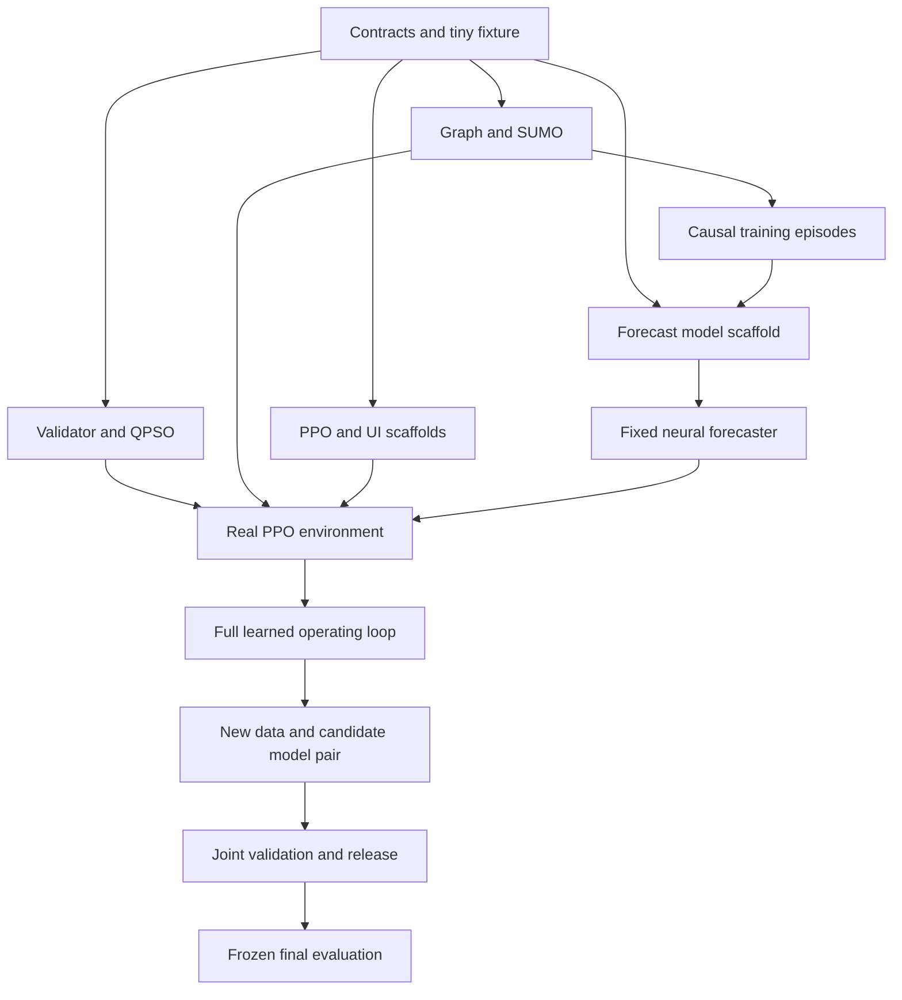

SIH26137 — step-by-step implementation plan

Execution companion to dynamic_routing_hackathon_blueprint.md. This plan retains the full GNN–Transformer–DRL–QPSO–SUMO architecture, continuous improvement, and every PS deliverable. The proposed module names below are files your team will implement; they are not software already created or tested in this conversation.

**Work in dependency order, with six parallel owners.** Use the 15-day window as an ambitious target, not a promise that training will finish on unknown hardware. Start with five jobs and two vehicles; scale the same complete loop to 100 customers and then larger offline cases. Persistence, rule policies and lightweight simulation are development fixtures and comparison baselines. The final delivery includes trained GNN–Transformer, trained PPO, working QPSO and SUMO execution.

| Person | Responsibility | Shared support |
|---|---|---|
| P1 | Graph/data generation, SUMO export/execution, traffic logging | P5 helps with adapter integration |
| P2 | Mathematical model, independent validator, tiny exact MILP, ALNS | P6 runs the evaluation harness |
| P3 | QPSO, route decoder/repair, PSO comparator, shortest-path mode | P2 checks constraint semantics |
| P4 | GNN, Transformer, forecasts, uncertainty, supervised retraining | P1 supplies observations and labels |
| P5 | DRL/PPO, scope builder, orchestrator, paired model releases | P6 owns UI presentation and replay controls |
| P6 | UI, benchmark automation, figures, documentation and pitch | Each owner provides module documentation |

P5 resolves interface conflicts. P2 owns feasibility truth. P3 owns search behavior. P4 owns prediction targets. P1 owns simulator measurement semantics. P6 makes the current integrated state visible from Day 1.

**Step 1 — create one project and freeze units. Owner: P5 with everyone. Day 1.**

1. Create one repository and environment lockfile. Record the installed Python/library/SUMO versions after a local compatibility check. Keep code and model/data manifests versioned; do not commit large generated datasets blindly.
2. Use meters, seconds, meters/second internally; keep speed limits' input conversion explicit. Demand remains abstract load units unless a physical conversion is supplied.
3. Give each scenario, road edge, customer request, vehicle, episode and model version a stable ID. Distinguish a road edge from a customer-to-customer routing arc.
4. Adopt one results schema and config format. P6 starts the UI on a clearly labelled fixture.

| Proposed location | Contents |
|---|---|
| `src/contracts/` | Scenario, observation, forecast, routes, decisions and result schemas |
| `src/data/` | CVRP parser, graph generator, windows, scenario splits |
| `src/sim/` | SUMO exporter, adapter, measurements, incidents and service state |
| `src/routing/` | Road path costs, route timing and independent validator |
| `src/optim/` | Encoding, QPSO, PSO, repair, local search, ALNS and exact reference |
| `src/learning/` | Window loader, GNN, Transformer, loss, PPO environment and training |
| `src/runtime/` | Operating loop, scope builder, safety rules and model-pair release |
| `src/evaluation/` | Replay runner, metrics, paired comparisons and plots |
| `app/` | UI and run controls |
| `configs/` | Small fixture, demo, training and benchmark configurations |
| `tests/` | Hand-verifiable mathematical and state-transition invariants |
| `artifacts/` | Locally generated data, checkpoints and experiment outputs |

Done when everyone can load the same scenario fixture and interpret every unit identically. Do not implement separate incompatible City classes.

**Step 2 — agree the contracts before coding independent modules. Owners: P2/P4/P5. Day 1.**

Define these objects and one tiny valid example of each:

| Object | Minimum fields |
|---|---|
| Scenario | IDs, source/checksum, units, graph, requests, fleet, configuration and separate randomness seeds |
| Observation | observation time, graph version, observed road values/masks, visible jobs, fleet position/load/commitments |
| Forecast | issue time, edge IDs, horizons, prediction/interval arrays, valid masks, target kind and model version |
| RoutePlan | per-vehicle job order, physical edge paths, expected times, served/frozen prefix and version |
| ScopeDecision | requested/executed action, mutable job/vehicle IDs, budget, overrides and reasons |
| SolveResult | method, routes, objective components, validation, elapsed time and search trace |
| ModelPair | forecaster/policy/scaler/schema versions, training cutoff, validation decision and parent pair |

Observation never includes future incident times, unreleased orders, hidden simulator seeds or future labels. Store those in an environment-only object. Done when P4 and P5 can consume fixtures without depending on unfinished simulation or optimization code.

**Step 3 — build the smallest hand-checkable problem. Owners: P1/P2. Day 1.**

Use a depot, five jobs, two vehicles, asymmetric legal roads, demands, service times and explicit service-start windows. Include an alternative road path around a closeable segment. Prepare four known examples: feasible routes, excess load, missed window and disconnected/wrong-way path. Include an early-arrival case that requires waiting.

Calculate expected load, travel, waiting and service times by hand. Keep a known feasible route as a regression fixture and initial seed. Done when the independent evaluator returns the expected outcomes. This fixture is not performance evidence.

**Step 4 — implement the CVRP-to-road dataset pipeline. Owner: P1. Days 1–3.**

1. Parse coordinates, demand, depot ID, capacity and the distance convention. Preserve the original `.vrp` and reference information unchanged.
2. Create a derived scenario with a declared isotropic scale; do not call benchmark coordinates real geography.
3. Generate road-junction candidates, connect them with a grid or Delaunay candidate skeleton, and prune while preserving connectivity and useful detour cycles.
4. Attach customer records to access points on roads, keeping their original coordinates and snap distances separately.
5. Create connected local/collector/arterial corridors; assign speeds and lanes consistently along them.
6. Add one-way directions only after checking required outbound/return reachability. Track physical road-pair IDs across split edges.
7. Generate service windows around a reference-feasible schedule with configurable slack. Label intentionally infeasible stress cases separately.
8. Write `scenario.json`, road/request/fleet tables and a provenance/quality report.

Done when the generator is reproducible, all jobs remain identifiable, open-network service access is valid, units are consistent and the reference schedule passes P2's checks. Produce irregular and grid families first; a radial family can be held out later.

**Step 5 — implement road costs and the independent route evaluator. Owner: P2. Days 1–3.**

Implement legal directed shortest paths, job-to-job cost views, and full route timing. For each selected physical path retain its distance, time and congestion components together. Never combine distance from one path with time from another.

Propagate arrival, waiting until the earliest service start, service duration, departure and depot return. Verify capacity, customer coverage, per-vehicle continuity, no subtours, time windows and legal road entry. Later add actual fleet positions, cargo ownership and executed-prefix locks. Cache paths by graph/cost/forecast version and departure bucket; invalidate affected entries after a change.

Expose `evaluate(routes, cost_view, constraints, commitments)`. Return detailed violations and components, not only True/False. Done when the small fixture catches every intentionally invalid example. Write down the snapshot mathematical model from the blueprint alongside the code; do not call snapshot optimization exact for the entire dynamic day.

**Step 6 — make SUMO execute the fixture. Owner: P1; P5 integrates. Days 1–3.**

1. Export node/edge inputs and compile with netconvert; preserve road-to-SUMO edge/lane mappings.
2. Validate turn connections, permitted directions and a single vehicle's source-to-destination route.
3. Add the depot, customer service stops, multiple delivery vehicles and background trips.
4. Use TraCI stepping to record vehicle progress, observations and stop/service events.
5. Keep requests, onboard cargo and delivery completion in application state. Mark a delivery complete only after the intended service event.
6. Add one road closure with a declared rule for vehicles already on the link; initially allow those vehicles to clear it while forbidding new entry.

Done when both fixture vehicles execute and the application matches their actual movement/service state. No teleportation, duplicate service, impossible turns, unexplained lost vehicles or double-counted toy signal penalties. P6 displays actual SUMO-derived progress once available.

**Step 7 — implement route encoding and bounded repair. Owner: P3; P2 reviews. Days 1–3.**

Start with 2n continuous keys: n vehicle-assignment preferences and n order priorities. Decode assignment preferences into the configured fleet, then sort priorities within each route. Use deterministic tie breaking and a documented boundary-handling rule. Locked cargo ignores incompatible vehicle-assignment keys.

Run P2's evaluator. Repair by removing conflicting mutable jobs and trying eligible feasible insertion positions under a strict attempt/deadline cap. Never create an extra vehicle or silently discard demand. Record infeasible results when repair fails. If repair/local search changes a plan, retain a consistent key encoding for its stored fitness.

Done when key changes produce distinct route candidates and repair either finds a valid result or returns a bounded failure. A decoder that always returns the same greedy solution has not implemented meaningful particle search.

**Step 8 — implement QPSO and the matched PSO comparator. Owner: P3. Days 2–4.**

Implement personal-best, global-best and mean-best state; the QPSO sampling update specified in the blueprint; explicit RNG input; finite boundary handling; and elapsed-time termination. Begin with a proposed 20-particle swarm on the tiny fixture and profile before increasing it.

Seed the swarm with a feasible constructive route, perturbed versions and diverse alternatives. Keep the best feasible incumbent separate from the best penalized infeasible particle. Log iteration/evaluator count, elapsed time, best feasible cost, feasible-particle fraction, diversity, repair time and incumbent origin. Add bounded relocate/swap improvement; evaluate directed route reversals correctly.

Implement classical PSO with the same encoding, decoder, initial mix, repair and local-search allowance. Done when both methods return independently validated plans and usable convergence traces. A feasible initial solution is acceptable but must be labelled if QPSO never improves it. QPSO stays in the final engine even if a baseline wins.

**Step 9 — build exact and independent heuristic references. Owner: P2; P6 runs them. Days 2–7.**

Implement the snapshot CVRPTW MILP from the blueprint on the five-job fixture. Compare a sufficiently small instance with exhaustive enumeration as a meaningful correctness check. Store incumbent objective, lower bound, status, time limit and gap tolerance. A time-limited nonzero-gap result is a bound/reference, not a certified optimum.

Implement ALNS using at least two removal operators, feasible reinsertion and recorded adaptive operator selection. Keep fixed fleet, windows and objective semantics consistent with QPSO. Add the OR-Tools Routing reference if available in the team's environment; do not label ordinary Routing output exact.

Done when all results pass the same independent checker. Extend exact cases only as tractable; preserve their benchmark objective and distance-rounding conventions.

**Step 10 — integrate the first complete routing loop. Owner: P5; all review. By Day 3–4.**

Wire scenario loading, SUMO observation, a temporary persistence forecast, initial QPSO solve, independent validation, commit, SUMO advance and outcome logging. P6's run/start/pause/replay controls call this actual loop.

Advance vehicles through legal future decision points; retain residual travel, service progress and cargo. Attach state versions to solve requests. A stale plan must be revalidated before application. Keep simulation time distinct from solve/training wall-clock time; disclose if simulation pauses while solving.

Done when one complete small episode runs without manual state repair. The temporary forecast and rule policy are explicitly marked baseline mode until trained models are integrated.

**Step 11 — generate causal traffic episodes and labels. Owner: P1; P4 specifies labels. Days 3–6, then ongoing.**

Generate background traffic, peak shifts, corridor congestion, closures and recovery using separate environment RNG streams. The forecasting labels come from observed SUMO outcomes, not weights supplied by the predictor.

Log one-minute edge features with observation age/missingness and finer trajectory entry/exit timestamps. Store issued forecasts separately. A future speed bucket matures only when its observations exist. Realized traversal labels mature when the corresponding vehicle exits; align them to the entry-time bucket. Sparse edges are missing data, not zero-duration examples. Distinguish speed-derived proxy travel times from measured traversal times through `target_kind`.

Start with six pilot episodes; measure wall-clock time, disk size and label coverage. Split base instances/maps and episodes into training, validation and untouched final-test groups before making overlapping windows. Done when future data cannot enter an observation and every training label has a valid availability time.

**Step 12 — implement the forecasting loader and baselines. Owner: P4. Days 1–4.**

Use fixture tensors first, then P1's logs. Construct 12-minute input windows and 5/10/15-minute targets without crossing episode boundaries. Fit scaling on training data only. Keep stable edge ordering, padding masks and missing-feature/target masks.

Implement persistence and a temporal-only model for later comparisons. With batch B, history L, edges E and feature count F, inputs are [B,L,E,F]. Make one manually inspected example showing issue time, visible window and label times. Done when shapes, masks and chronology are correct; low training loss alone is not sufficient.

**Step 13 — build and train the GNN–Transformer. Owner: P4. Days 3–7.**

1. Implement two edge-aware graph layers, initially width 32 or 64, using legal directed connectivity and endpoint/edge features.
2. Decode per-road spatial embeddings; do not pool all roads into one vector before per-edge forecasting.
3. Reshape embeddings to [B×E,L,d] and apply a small temporal Transformer with positional/time encodings; choose a head count dividing d.
4. Predict horizon-specific speed ratio and, where labels support it, traversal-time estimates. Accessibility/closure status uses a separate mask/channel rather than infinite regression targets.
5. Train both GNN and Transformer jointly using masked supervised loss. Re-encode raw windows after encoder changes instead of reusing stale embeddings.
6. Save weights, feature schema, scaler, training cutoff, split manifest, seed and validation metrics as forecaster v1.

Measure horizon MAE/RMSE, valid-label coverage, incident error and per-map error. Train-versus-validation curves reveal overfitting. Done when a trained causal model is integrated and evaluated against persistence and the temporal-only baseline. Do not promise it will win before measuring.

**Step 14 — add uncertainty and forecast-aware routing costs. Owners: P4/P3/P5. Days 5–8.**

Implement either validation-residual intervals or quantile heads; for q0.1/q0.9 report nominal 80% coverage and actual held-out coverage/width. MC dropout can be a comparison, but variance is not automatically calibrated uncertainty.

Issue forecasts with time/version metadata. At a candidate road-entry time, interpolate within the horizon and use a declared current/time-of-day extension beyond it. Reduce reliance on stale/uncertain forecasts using a validation-tuned rule. Known closures override predicted accessibility. Preserve FIFO in temporal traversal evaluation and distinguish planner estimates from realized SUMO execution.

Check that changing a forecast can change candidate costs and the resulting route on a controlled example. Done when the forecast influences QPSO decisions, uncertainty is measurable and no future simulator labels reach the planner. Adding edge upper quantiles does not establish a guaranteed route-level confidence interval.

**Step 15 — implement all five scope actions. Owner: P5; P3 supports. Days 3–6.**

| Action | Exact initial behavior |
|---|---|
| KEEP | Preserve job order/assignment; apply mandatory legal road detours |
| LOCAL | Replan up to 10 impact-ranked mutable jobs across affected vehicles |
| VEHICLE | Replan the mutable suffix of the most affected vehicle |
| REGIONAL | Replan eligible mutable jobs in affected and neighboring zones |
| GLOBAL | Replan all legally mutable suffixes |

Detect affected routes using their planned physical road paths and propagated deadline slack. Return exact job/vehicle IDs, not only an action name. Preserve served prefixes and cargo ownership under every action. Handle duplicate/empty scopes consistently. Begin with the blueprint's proposed budgets, then measure total response time.

Implement rule decisions for the baseline and permanent safety overrides. Done when each action produces the stated scope, and invalid KEEP decisions are overridden without changing history or inventing cargo.

**Step 16 — build the PPO environment and measure training throughput. Owner: P5. Days 3–6.**

Observation combines pooled GNN embeddings, forecast/uncertainty summaries, events, affected-route fraction, deadline slack, remaining work/load and recent decisions. Use the agreed five-action interface.

One step builds the action scope, invokes actual QPSO if needed, validates, advances SUMO through a fixed decision interval and returns the next observation/reward. Start with a 60-second decision interval and immediate independent safety handling for urgent events. If intervals later vary, account for elapsed time in discounting and reward.

Reward uses realized incremental operating cost, congestion exposure, service failures, churn and computation, plus terminal unfinished-work penalties. Enforce legality in the validator, not only through rewards. Log requested action, executed action, override reason and each reward component. Use an explicitly supported masking mechanism if required; do not assume plain PPO masks actions automatically.

Done when repeated environment steps are correct and their wall-clock cost is measured. Estimate training cost as intended environment steps × observed seconds per step, accounting for parallel environments and shared hardware contention. Adjust curriculum/scale accordingly.

**Step 17 — train and integrate DRL. Owner: P5; P4 freezes the forecaster. Days 5–9.**

Train initially on smaller SUMO maps with simple incidents and short episodes, then expand the curriculum. A persistence-forecast pilot can run before the neural predictor is ready. Final training/fine-tuning uses a fixed neural forecaster and its fixed scaler/schema.

Collect fresh on-policy PPO rollouts and update actor/critic. Do not reuse arbitrary historical trajectories as standard PPO training data. Freeze the forecaster throughout each rollout/update cycle; collect fresh rollouts when its version changes. If early training uses a fast lightweight simulator, adapt and evaluate the final policy in SUMO.

Compare with rule control and event-global QPSO on held-out scenarios. Inspect action frequencies, overrides, reward components, unserved jobs, latency and routing cost. Done when the trained controller is active in the full loop and its performance is documented. Always selecting one action is a diagnostic to investigate, not automatic proof of a bug or a successful policy.

**Step 18 — complete shortest-path mode and the first scaling run. Owners: P3/P2/P6. Days 6–9.**

Implement source/destination QPSO path search with legal loop-free decoding and bounded backtracking; return failure on dead ends. Compare against Dijkstra using identical fixed nonnegative edge weights. Expose path cost, gap, validity and runtime in a separate UI mode.

For fleet scaling, run 50, 100, 250 and a planned 500-customer case, recording road vertices/arcs, fleet, budget, memory, runtime and feasibility. Run separate sweeps varying road size with customer count fixed and customer count with road size fixed. Larger runs may be offline replays but must be clearly labelled.

Done when shortest-path and scale evidence exist independently of the 100-customer live demo. Dijkstra is an exact reference for its snapshot path task; do not claim QPSO must beat it. Planned sizes/budgets are targets, not measured capability.

**Step 19 — run the full architecture and make its behavior visible. Owners: P5/P6 with P1/P3/P4. By Day 9.**

Connect actual GNN, Transformer, PPO, QPSO and SUMO. The UI should show forecast versus later observation, uncertainty, DRL action/scope, QPSO convergence, validated routes, service progress, model-pair version and measured latency.

Run a normal episode, corridor slowdown and road closure. Check that forecast changes affect planning and that DRL actions invoke actual restricted QPSO search. Capture all state/model versions for replay. Done when no core component is represented by an unlabelled stub, and the full loop executes without state corruption.

**Step 20 — implement supervised prediction updates. Owner: P4; P1 supplies new episodes. Days 8–11.**

Save every forecast at issue time. Match later valid measurements to that record after labels mature. Gather new training examples and a scenario-balanced sample of older data to reduce forgetting. Trigger a candidate training job after an initial configured batch, for example 20 completed training episodes; tune cadence using measured throughput.

Train candidate forecaster v2 while v1 continues serving the active episode. Evaluate v2 on a reserved validation set and check horizon error, coverage, incident behavior and latency. Record both improvements and regressions. Done when a reproducible training attempt produces a versioned candidate and a validation decision. Logging errors without retraining is not continuous learning.

**Step 21 — update PPO and release a validated model pair. Owner: P5; P4/P2 review. Days 9–12.**

A new forecaster changes PPO's input distribution. Freeze the candidate forecaster, collect fresh rollouts, fine-tune or retrain the candidate policy, and validate the pair jointly. Do not update the forecasting encoder through PPO rewards in this architecture; its gradients come from supervised forecasting loss.

Predeclare acceptable forecast/routing/latency tolerances and require no new legality failures. Compare old/new pairs on identical reserved scenarios. Promote at an episode boundary only if the pair passes; otherwise retain the old pair and log the reason. Save model/scaler/schema/action/reward/QPSO/SUMO versions and the parent release. Test rollback.

Done when one complete update attempt is auditable, including an honest accepted or rejected decision. Keep a final unseen test set untouched by promotion choices. Improvements are possible, not guaranteed on every update.

**Step 22 — run the required comparisons and ablations. Owners: P2/P6; each owner diagnoses their component. Days 10–13.**

| Experiment | Keep fixed | Measure |
|---|---|---|
| QPSO vs PSO | Encoding, repair, local search, constraints, initial mix and budget | Best-feasible cost, first-feasible time, evaluations and convergence |
| QPSO vs ALNS | Scenario, constraints, objective, visibility and wall-clock budget | Quality, latency, feasibility and compute |
| Tiny exact vs heuristics | Identical snapshot model/costs | Certified gap or clearly labelled bound/reference gap |
| Cold vs warm QPSO | Same event, scope, decoder and budget | Adaptation quality/time and route churn |
| QPSO with/without local search | Same search budget and seed protocol | Contribution of local improvement |
| Persistence vs neural forecast | Same QPSO and rule controller | Forecast and downstream routing value |
| Temporal-only vs GNN–Transformer | Data splits and target metrics | Added spatial modeling value |
| Rules vs PPO | Same forecaster, QPSO and action semantics | Routing/compute trade-off and safety overrides |
| Old vs candidate model pair | Reserved scenarios and simulator configuration | Forecast, policy and joint outcome changes |
| Path and scale | Declared cost/budget conventions | Path validity/gap; customer/road resource scaling |

Use shared exogenous background trip/event tapes, revealed causally. SUMO traffic outcomes may differ when policies change traffic. Pair results by episode/map; do not treat overlapping windows as independent experiments. Include failures and unserved jobs. Preserve native static benchmark objectives and rounding; original CVRP optima do not certify transformed road-traffic outcomes.

Start with the blueprint's small benchmark matrix, pilot throughput, then expand. Report actual repetitions, hardware, training time, inference time and p95 end-to-end replanning latency. Done when figures are generated from saved records and every reported comparison is reproducible.

**Step 23 — freeze, test and package the complete submission. Owners: all; P6 packages. Days 13–15.**

Freeze the model pair, optimizer/config versions and final test manifest. Disable learning during final benchmark runs. Execute fresh unseen scenarios; do not retune from those results. If fixing a substantive bug changes results, regenerate affected evidence and disclose the revision.

Package source/setup, graph/scenario provenance, SUMO files, model/checkpoint manifests, mathematical formulation, independent validator, QPSO description, baselines/exact references, raw results, plots, model update history, UI and demonstration instructions. Include the network/compute assumptions and limitations.

Rehearse five minutes: normal traffic, forecast change, PPO scope decision, QPSO convergence, legal SUMO recovery, measured comparisons and the validated update mechanism. Keep a labelled recorded replay for failure recovery. Done when another teammate can launch the complete demo using the documented environment and reproduce a selected result.

**Use this day-by-day coordination board.** Each cell is the primary focus; owners continue fixing their earlier interfaces.

| Day | P1 | P2 | P3 | P4 | P5 | P6 |
|---|---|---|---|---|---|---|
| 1 | Graph/SUMO fixture | Hand model/checks | Keys/QPSO kernel | Forecast contracts | Shared loop/contracts | UI fixture |
| 2 | Export and stops | Timing/MILP | Decoder/repair | Loader/GNN | Fleet state | Route display |
| 3 | First logs | Exact verification | QPSO/PSO | Temporal model | Base integration | Actual run controls |
| 4 | Varied traffic | ALNS | Warm starts | First neural training | Scopes/PPO wrapper | Metrics/log viewer |
| 5 | Causal labels | Baseline audit | Local search | Forecast validation | PPO pilot | Forecast/action panels |
| 6 | Scenario diversity | Baseline runs | Dynamic profiling | Uncertainty | Throughput/curriculum | Replay harness |
| 7 | SUMO coverage | Exact/static tests | Path mode | Freeze v1 | PPO on v1 | Comparative views |
| 8 | New episodes | Scale protocol | Scale/profiling | Retraining pipeline | Neural policy integration | Run automation |
| 9 | Larger maps | Model/constraint audit | Full-loop support | Candidate forecast | Full learned loop | Integration demo |
| 10 | Update episodes | Paired comparisons | Optimizer ablations | Train v2 | Fresh PPO rollouts | Charts |
| 11 | Data checks | Update validation | Regression fixes | Evaluate v2 | Candidate policy | Update-history panel |
| 12 | Held-out manifest | Evidence review | Fix measured faults | Pair checks | Promote/reject/rollback | Report draft |
| 13 | Final scenarios | Final tests | Frozen search | Frozen forecast | Frozen policy | Final test figures |
| 14 | Reproduction | Mathematical appendix | Algorithm appendix | Learning appendix | Release check | Demo rehearsal |
| 15 | Demo support | Results questions | Algorithm questions | Prediction questions | Integration support | Final presentation |

**The real dependency graph explains what can run together.**

Do not wait for the final GNN to start the PPO wrapper, or the final model to start the UI. Do wait for real simulator/solver behavior before treating PPO training as meaningful. Keep forecast weights fixed within policy-training batches.

**Hold one short daily integration review.** Ask: what is runnable, which contract changed, what is the concrete blocker, and what is today's acceptance check? Demonstrate a small current end-to-end run, not only slides. On Day 3 and Day 6, use measured simulation/solve/train throughput to reassess the schedule. Reduce experiment volume or map/model size first. Retain all agreed components; explicitly revise timing if the full scope cannot meet the remaining window.

**The first action for the team is Step 1 plus the five-job fixture.** Once the common contracts exist, all six owners can begin immediately. The project is complete when the full learned loop and PS evidence are implemented and demonstrated—not merely when every model has a Python class.

## Delivery Table (Expected Deliverables)

Official SIH26137 expected outputs, mapped to this repo. Status reflects the current codebase (Steps 1–8 implemented; Steps 9–23 still open).

| ID | Deliverable | What it must contain | Repo location / next owner | Status |
|---|---|---|---|---|
| D1 | Graph-based network model | Weighted directed road graph with stable IDs; distance, time and congestion weights; dynamic updates (closures, slowdowns) | `src/data/`, `src/contracts/scenario.py`, `generated_dataset/`, `dynamic_pilot/` — P1 | **Done** for fixtures and generated maps |
| D2 | Mathematical formulation + constraints | Snapshot CVRPTW equations; capacity, time windows, depot return, flow/subtour rules; worked 5-job example | `docs/routing_snapshot_model.md`, `src/routing/route_evaluator.py`, `src/routing/validator.py` — P2 | **Done** for snapshot evaluation; tiny exact MILP still missing |
| D3 | Quantum-inspired optimizer (QPSO) | Random-key encoding, QPSO update, repair, local search, convergence traces; PSO comparator | `src/optim/qpso.py`, `src/routing/route_encoding.py`, `src/optim/pso.py` — P3 | **Done** on the tiny fixture; fleet shortest-path mode and scaling not done |
| D4 | Executable platform (UI/API) | Load scenario, solve, inject traffic change, inspect routes, replay | `app/` dispatcher at http://127.0.0.1:8765 — P5/P6 | **Demo live** |
| D5 | Demonstration + documentation | Synthetic urban network, traffic episodes, algorithm write-up, setup guide, raw results | `fixtures/`, `docs/`, `README.md` — All; P6 packages | **Partial** (data + math docs exist; report, plots and demo script do not) |
| D6 | Conventional + exact benchmarks | Matched-budget QPSO vs PSO vs ALNS; tiny MILP / Dijkstra gaps; convergence and scalability figures | `src/optim/` has QPSO vs PSO only — P2/P6 | **Partial** (PSO exists; ALNS, MILP, path-mode and scale sweeps missing) |
| D7 | Dynamic closed loop | Observe traffic → forecast → decide replan scope → QPSO → validate → SUMO advance | `src/sim/` exists; `src/runtime/` and `src/learning/` do not — P5 | **Partial** (SUMO fixture runs; no orchestrator, no learned forecast/policy) |
| D8 | Traffic forecast model | GNN–Transformer, persistence and temporal-only baselines, uncertainty, causal labels | `src/data/causal_episodes.py`, `src/learning/` — P4 | **Steps 11–12 done** (GNN not trained) |
| D9 | Replanning controller | Five scope actions + rule baseline + trained PPO | `src/runtime/`, `src/learning/` — P5 | **Not started** |
| D10 | Evaluation harness | Replay, paired comparisons, ablations, plots, frozen final-test set | `src/evaluation/` — P6 | **Not started** |
